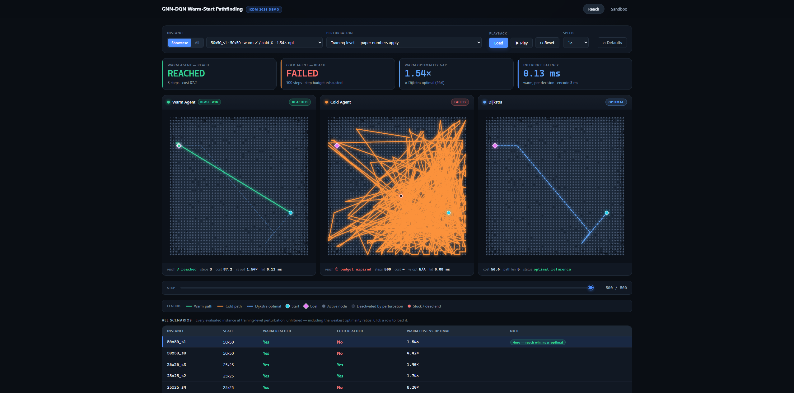

# QWarm-RL — GNN-RL Warm-Starting for Dynamic Routing

An interactive browser demo and reproducibility package for a GraphSAGE-DQN
routing agent that learns to navigate a perturbing dynamic graph. A
**warm-started** agent — pre-seeded with a mixed pool of classical
(A\*/k-shortest-paths) and simulated-quantum (QAOA / noisy stochastic A\*)
demonstrations, trained with DQfD-style expert-margin loss — is raced
head-to-head against a **cold-started** agent trained from scratch on the
identical graph and perturbation sequence. Warm-starting reaches 96% of
25×25 cells (52% cold) and 88% of 50×50 cells (12% cold); see
[Reproducing the paper's numbers](#reproducing-the-papers-numbers) below.



Paper under review at IEEE ICDM 2026 (demo track).

## Quick start (one command)

```bash
git clone https://github.com/Amir-Shahriari/qwarm-gnn-rl.git
cd qwarm-gnn-rl
uv sync --extra dev
uv run python scripts/run_demo.py
```

Open `http://127.0.0.1:8765`. A loading screen with an elapsed-time counter
shows while the server precomputes all 10 scenarios; the demo becomes
interactive in roughly 20-30s after dependencies are installed (measured
sequential startup on a CPU-only dev machine: ~17-18s of that is the
precompute step itself). Dependency install time on top of that depends
entirely on network speed and whether `uv`'s cache is warm.

Works fully offline once dependencies are installed — no network calls at
runtime.

**Hardware:** CPU-only, no GPU required. ~4GB RAM, ~1GB disk (including
committed checkpoints). An NVIDIA GPU is used automatically if present, but
never required. On **Linux** specifically, the plain PyPI `torch` wheel
`uv sync` resolves to pulls in the full CUDA runtime as a transitive
dependency (no CPU-only variant exists on the plain index — that split only
exists on PyTorch's own `cpu`/`cu128` indices), so *install* size is larger
there even though the *runtime* path is genuinely CPU-only. macOS and
Windows wheels don't have this issue.

## Reproducing the paper's numbers

```bash
uv run python verify_demo_claims.py
```

Re-derives the paper's headline numbers from the committed per-cell
artefacts in `runs/` (no retraining required) and fails loudly if anything
diverges:

| Claim | Command / artefact |
|---|---|
| 25×25 warm 96% / cold 52%, 88%/12% at 50×50, 84% paired win-rate, mean gaps 4.42×/17.3× | `runs/sweep_phase3_final.json`, `runs/sweep_50x50/sweep_v1_50x50_{1x,4x}.json` |
| 24/24 and 22/22 reach over structurally-solvable cells | `runs/eval_reachability_audit.json` |
| Source-ablation reach (classical_only/quantum_only/full-pool) | `runs/demo_source_ablation_partial.json`, `runs/sweep_phase3_traced.json` — covers only the cells actually trained per arm (5/24 and 4/24 of the solvable 25×25 cells for classical_only/quantum_only respectively, all reached); this is not full 24/24 coverage (see the `check_ablation_subset_reach` docstring in `verify_demo_claims.py` for the exact caveat) |
| Fleet throughput (138×) | `runs/fleet_1779277545_seed42/fleet_results.json` |
| Reward-shaping control (demonstration-free λ-sweep, 5 arms) | `scripts/run_shaping_control.py`, `runs/shaping_control/{lambda_*.json,aggregate.json}` — a range claim over all five arms, not a single "best arm" number |

Full training/eval provenance and seeds: `scripts/run_multi_seed_warm_vs_cold.py`
(25×25) and `scripts/run_sweep_50x50.py` (50×50), outer seeds
`[42, 1337, 2024, 7, 314159]`.

Note: `uv sync --extra dev` (the install path above) does not include
`qiskit`/`qiskit-aer`, so it cannot reproduce the `oracle_pool="full"` warm
arm used by these scripts — full-pool *training* raises an `ImportError` on
`FaithfulSimulatedQAOA` without it. `verify_demo_claims.py` and the live demo
don't need it (they read committed artefacts / load checkpoints); only
*fresh* full-pool retraining does — in that case run
`uv sync --extra dev --extra qiskit_backend` first.

## Troubleshooting

- **Port 8765 already in use:** `uv run python scripts/run_demo.py --port 8766`.
- **Wrong Python version:** this project requires Python 3.11 (`requires-python = ">=3.11,<3.12"` in `pyproject.toml`). `uv python install 3.11` if you don't have it, then re-run `uv sync`.
- **"missing checkpoint" error at startup:** `demo_agents/*.pt` and `runs/traces_25x25/seed42_*/{classical_only,quantum_only}/agent.pt` must be present — these are committed to git, not downloaded; if they're missing you likely have a shallow/partial clone. Re-clone fully.
- **`uv sync` tries to reach the network and fails (fully offline machine):** dependencies must be resolved with network access at least once (to populate `uv`'s cache); after that, `uv sync --offline` works from cache.
- **CUDA/GPU errors:** the default install is CPU-only and never touches CUDA at runtime; if you manually installed a CUDA build of torch and it's misconfigured, `uv pip install torch --index-url https://download.pytorch.org/whl/cu128 --force-reinstall`, or just re-run `uv sync` to fall back to the CPU wheel.
- **CI reference:** `.github/workflows/ci.yml` runs, in order: unit tests (`pytest -m "not slow" --cov=qwarm`), the offline-operation test (`tests/test_offline.py`), the headless demo smoke test (`tests/test_demo_smoke.py`), and the claims-verification gate (`verify_demo_claims.py`).

## License

MIT — see `LICENSE`.
